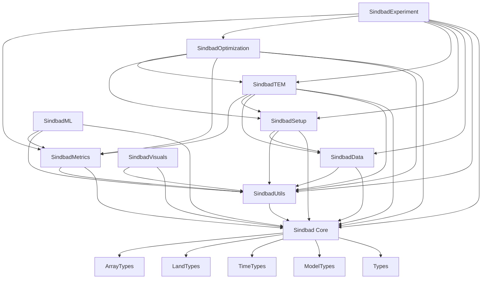

# SINDBAD Packages Overview

This page provides an overview of all SINDBAD packages and their main functionalities.

| Package | Description | Key Features |
|---------|-------------|--------------|
| [Core](sindbad.md) | Core package `Sindbad` | Main package for model processes and types |
| [ Models](models.md) | Model implementations | Ecosystem model processes and approaches |
| [ Types](types.md) | SINDBAD Types | Definition of all SINDBAD types and purposes |
| [Data](data.md) | Data handling | Input/output operations, data processing, and handling |
| [Experiment](experiment.md) | Simulation experiments | Experiment setup, configuration, and execution |
| [Metrics](metrics.md) | Performance metrics | Cost functions, evaluation metrics, and validation tools |
| [ML](ml.md) | Machine learning | Machine learning integration and model training |
| [Optimization](optimization.md) | Optimization methods | Parameter optimization and calibration |
| [Setup](setup.md) | Setup utilities | configuration of SINDBAD experiment and setup |
| [TEM](tem.md) | Terrestrial Ecosystem Model | Core ecosystem modeling framework |
| [Utils](utils.md) | Utility functions | Helper functions and common utilities for all packages|
| [Visuals](visuals.md) | Visualization tools | Plotting and data visualization helpers |


::: tip `Exported` and `Internal` Sections

In the `automated` documentation,

- `Exported` entities (functions, structs, types, constants):

These are explicitly made available to users using the `export` keyword, allowing them to be accessed without prefixing them with the module name.

- `Internal` entities (non-exported):

These remain accessible but require qualification with the module name (e.g., `MyModule.SomeType`), indicating that they are intended for internal use.

:::


## Package Descriptions

### Core Packages
- **Sindbad**: The main package that provides the core of SINDBAD.
  - **Models**: Module that implements various ecosystem model components and approaches.
  - **Types**: Module that defines various types for dispatching on methods ranging from setup to cost computation.
- **TEM**: Provides the Terrestrial Ecosystem Model framework and its execution.

### Modeling Packages
- **Experiment**: Manages experiment setup, configuration, and simulations.
- **Metrics**: Implements performance metrics and cost functions.
- **ML**: Integrates machine learning capabilities for model training and analysis.
- **Optimization**: Provides methods for parameter optimization and model calibration.

### Utility Packages
- **Data**: Handles all data-related operations including input/output, data processing, and management.
- **Setup**: Contains configuration tools for SINDBAD info.
- **Utils**: Provides helper functions and common utilities used across packages.
- **Visuals**: Offers tools and helpers for data visualization and plotting.


## Sindbad Package Dependencies


Package Dependency


::: info Package Usage

- Most application packages can be used independently for specific tasks
- The core `Sindbad` and ```SindbadUtils``` are required

::: 


